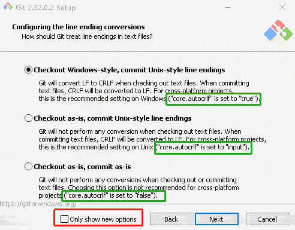

<div style="text-align: center;font-size: 40px;">git</div>

## [reference](https://git-scm.com/docs/)

---

## 本地仓库

### 初始化

```shell
# 初始化不指定分支名称 默认创建 master 分支
git init -b <branch-name> --initial-branch=<branch-name>

git init -b develop
git config --local user.email "xxx@xx.com"
git config --local user.name "caddy"
git status
git add README.md
git commit -m "feat: init"
git log --pretty=oneline
```

### 添加远程分支

```shell
# 可以添加多个远程仓库 比如一份代码需要提交到两个仓库
git remote add origin https://xxx/temp.git
git remote
git fetch origin

# gitlab 默认将 master 分支设置为 protect 不允许强制 push
# git push -f 强制提交 风险极高 本地commit会强制覆盖远程commit
git push -f origin develop
```

### gitlab

#### Create a new repository

```shell
git clone URL
cd testcaddy
touch README.md
git add README.md
git commit -m "add README"
git push -u origin master
```

#### Push an existing folder

```shell
cd existing_folder
git init
git remote add origin URL
git add .
git commit -m "Initial commit"
git push -u origin master
```

#### Push an existing Git repository

```shell
cd existing_repo
git remote rename origin old-origin
git remote add origin URL
git push -u origin --all
git push -u origin --tags
```

---

## 从远程仓库获取

```shell
git clone https://xxx/caddy/temp
git branch   #(查看本地分支)
git branch -r #(查看远程分支)
git branch -a #(查看全部分支)
git checkout -b develop origin/develop
git branch temp #(以当前分支为基线创建temp分支)
git branch temp base #(以base为基线创建temp分支,base可以为tag)
git checkout -b temp #(以当前分支为基线创建temp分支,并切换到temp分支)
git checkout -b temp base #(以base为基线创建temp分支并切换到temp,base可以为tag)
git checkout temp #(切换到temp分支)
```

---

## [git merge](https://git-scm.com/docs/git-merge)

***merge 之前 两个分支都要先 commit***

1. 当前分支 develop 将 temp 分支合并到develop `git merge temp`
2. 产生冲突（IDEA工具更方便处理冲突）
3. 手动处理冲突代码执行`git add 冲突文件` 然后 `git commit -m "feat: merge temp into develop"`

---

## [git rebase](https://git-scm.com/docs/git-rebase)

#### 基操

```shell
git rebase b2 #(当前在b1分支)
git rebase b2 b1 #(b1基线变更为b2)
```

***仅推荐在本地分支push前合并未提交到远程的 commit，不熟悉rebase机制 易造成 git 提交顺序日期混乱***

#### 冲突

```shell
git add .
git rebase --continue #(继续)
git rebase --skip #(跳过)
git rebase --abort #(取消 rebase)
```

***有冲突，解决冲突（建议使用idea解决冲突）,将解决冲突后的文件加入仓库，rebase 每个 commit 都可能会有冲突，依次解决所有 commit 的冲突***

### 合并多个未提交 commit

1. 在当前分支的起始点（如提交码为12345678），rebase时以此节点为基础 rebase `git rebase -i 12345678`
2. 自动进入 vim 编辑模式，可以看到 12345678 到当前的所有 commit 信息
3. 第一行pick commit，其余行squash，wq保存
4. 编辑 git message 作为合并后的 commit message，wq保存
5. 有冲突手动解决后执行`git add .`和`git --continue`,直到所有冲突解决完成，则选择的commit会合并为一个commit

***

- ***仅限本地分支进行***
- ***切勿对已提交的commit合并***
- ***可使用 reflog 进行回退***

---

## git crlf & lf

- [GitHub reference](https://docs.github.com/en/get-started/getting-started-with-git/configuring-git-to-handle-line-endings)
- [git reference](https://git-scm.com/book/en/v2/Customizing-Git-Git-Configuration)

> core.autocrlf false
> > If you’re a Windows programmer doing a Windows-only project, then you can turn off this functionality, \
> > recording the carriage returns in the repository by setting the config value to false
>
>core.autocrlf true
>> If you’re on a Windows machine, set it to true this converts LF endings into CRLF when you check out code:
>
>core.autocrlf input
>> If you’re on a Linux or macOS system that uses LF line endings, \
> > then you don’t want Git to automatically convert them when you check out files; \
> > however, if a file with CRLF endings accidentally gets introduced, then you may want Git to fix it. \
> > You can tell Git to convert CRLF to LF on commit but not the other way around by setting core.autocrlf to input: \
> > This setup should leave you with CRLF endings in Windows checkouts, \
> > but LF endings on macOS and Linux systems and in the repository.


***主要应对 shell 脚本、bat 批处理文件等对换行敏感的语言***

***不建议直接 copy 文件；手动创建文件 copy 文件内容相对稳妥***

***当添加配置文件或使用参数配置后，并不会生效。配置文件方式重新clone代码即可生效，`git config` 删掉除.git的全部文件,手动下载仓库代码，然后解压把代码放进去即可***

#### 配置 core.autocrlf

- 全局
    - linux & mac `git config --global core.autocrlf input`
    - windows `git config --global core.autocrlf true` 安装时默认设置为 true 
- 单库
    - linux & mac `git config --local core.autocrlf input`
    - windows `git config --local core.autocrlf true`

#### config file

```text
# windows C:\Users\xxx\.gitconfig
[core]
	autocrlf = true
# .git/config
[core]
	autocrlf = true
```

***The .gitattributes file must be created in the root of the repository and committed like any other file.***

#### .gitattributes

```properties
#
# https://help.github.com/articles/dealing-with-line-endings/
#
# Set the default behavior, in case people don't have core.autocrlf set.
# text=auto Git will handle the files in whatever way it thinks is best. This is a good default option
# * text=auto
# text eol=crlf Git will always convert line endings to CRLF on checkout. You should use this for files that must keep CRLF endings, even on OSX or Linux.
# * text eol=crlf
# text eol=lf Git will always convert line endings to LF on checkout. You should use this for files that must keep LF endings, even on Windows.
* text eol=lf
# Explicitly declare text files you want to always be normalized and converted
# to native line endings on checkout.
*.c text
*.h text
*.cpp text
*.hpp text
*.cmake text
*.sh text
*.md text
*.java text
*.py text
*.sql text
*.xml text
*.yml text
*.yaml text
*.properties text
*.gradle text
*.pom text
# Declare files that will always have CRLF line endings on checkout.
*.sln text eol=crlf
*.bat text eol=crlf
# Denote all files that are truly binary and should not be modified.
*.png binary
*.jpg binary
*.jpeg binary
```

#### 刷新应用配置

```shell
git rm --cached -r
git reset --hard
```

---

## 查看其他分支文件

```shell
git show develop:README.md
```

---

## git 配置用户名 & email

#### local

##### command

```shell
git config user.name xxx
git config user.email xxx@163.com
```

##### 编辑 配置文件

```
vim .git/config
[user]
email = xxx@163.com
```

#### global

```shell
git config --global user.name xxx
git config --global user.email xxx@qq.com
```

---

## [HOME](../index.md)