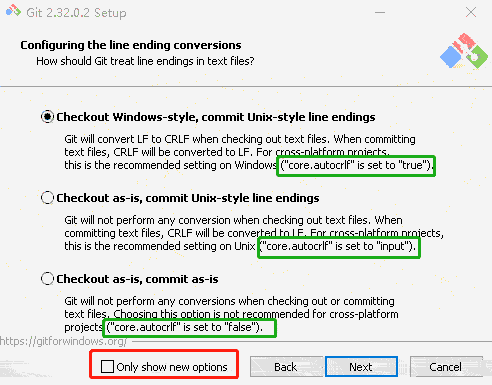

<div style="text-align: center;font-size: 40px;">git config</div>

> 说明：\
全局配置目录 windows10 `C:\Users\xxx\.gitconfig` \
当前工作目录文件 `workdir/.git/config`

---
- `git config -h`
- 查看 global 全部 配置  `git config -l` or `git config -l --global`
- 查看 local 全部 配置  `git config -l --local`

---
## user & email

```
vim .git/config
[user]
	name = xxx
	email = xxx@xx.com
```

- 全局 git user
    - `git config --global user.name xxx`
    - `git config --global user.email xxx@xx.com`
- 单库 git user
    - `git config user.name xxx` or `git config --local user.name xxx`
    - `git config user.email xxx@xx.com` or `git config --local user.email xxx@xx.com`
---
## remote branch

- 添加远程分支
    - 可以添加多个远程仓库 比如一份代码需要提交到两个仓库
    - `git remote add repo_name https://xxx/temp.git`
    - 查看远程分支 `git remote`
    - 从repo_name 远程仓库 fetch code `git fetch repo_name`
    - 推送到 repo_name 远程仓库的 develop分支 `git push repo_name develop`

---
## crlf & lf

- [GitHub reference](https://docs.github.com/en/get-started/getting-started-with-git/configuring-git-to-handle-line-endings)
- [git reference](https://git-scm.com/book/en/v2/Customizing-Git-Git-Configuration)

> core.autocrlf false
> > If you’re a Windows programmer doing a Windows-only project, then you can turn off this functionality, \
> > recording the carriage returns in the repository by setting the config value to false
>
>core.autocrlf true
>> If you’re on a Windows machine, set it to true this converts LF endings into CRLF when you check out code:
>
>core.autocrlf input
>> If you’re on a Linux or macOS system that uses LF line endings, \
> > then you don’t want Git to automatically convert them when you check out files; \
> > however, if a file with CRLF endings accidentally gets introduced, then you may want Git to fix it. \
> > You can tell Git to convert CRLF to LF on commit but not the other way around by setting core.autocrlf to input: \
> > This setup should leave you with CRLF endings in Windows checkouts, \
> > but LF endings on macOS and Linux systems and in the repository.


***主要应对 shell 脚本、bat 批处理文件等对换行敏感的语言***

***不建议直接 copy 文件；手动创建文件 copy 文件内容相对稳妥***

***当添加配置文件或使用参数配置后，并不会生效。配置文件方式重新clone代码即可生效，`git config` 删掉除.git的全部文件,手动下载仓库代码，然后解压把代码放进去即可***

### 配置 core.autocrlf

- 全局
    - linux & mac `git config --global core.autocrlf input`
    - windows `git config --global core.autocrlf true` 安装时默认设置为 true 
- 单库
    - linux & mac `git config --local core.autocrlf input`
    - windows `git config --local core.autocrlf true`


#### config file

```text
# 全局 windows C:\Users\xxx\.gitconfig
[core]
	autocrlf = true


# 单库 .git/config
[core]
	autocrlf = true
```

***The .gitattributes file must be created in the root of the repository and committed like any other file.***

#### .gitattributes

```properties
#
# https://help.github.com/articles/dealing-with-line-endings/
#
# Set the default behavior, in case people don't have core.autocrlf set.
# text=auto Git will handle the files in whatever way it thinks is best. This is a good default option
# * text=auto
# text eol=crlf Git will always convert line endings to CRLF on checkout. You should use this for files that must keep CRLF endings, even on OSX or Linux.
# * text eol=crlf
# text eol=lf Git will always convert line endings to LF on checkout. You should use this for files that must keep LF endings, even on Windows.
* text eol=lf
# Explicitly declare text files you want to always be normalized and converted
# to native line endings on checkout.
*.c text
*.h text
*.cpp text
*.hpp text
*.cmake text
*.sh text
*.md text
*.java text
*.py text
*.sql text
*.xml text
*.yml text
*.yaml text
*.properties text
*.gradle text
*.pom text
# Declare files that will always have CRLF line endings on checkout.
*.sln text eol=crlf
*.bat text eol=crlf
# Denote all files that are truly binary and should not be modified.
*.png binary
*.jpg binary
*.jpeg binary
```

#### 刷新应用配置

```shell
git rm --cached -r
git reset --hard
```
