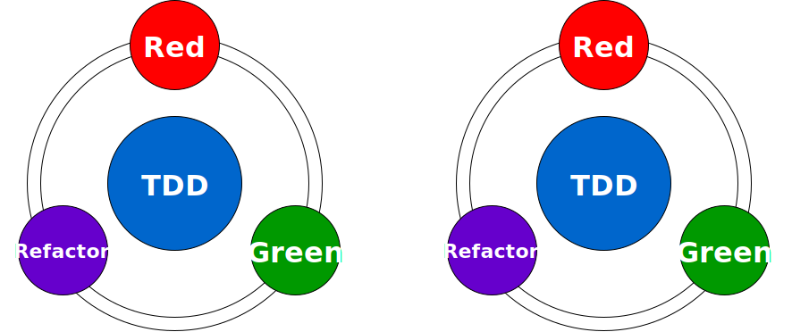

敏捷开发

## MVP 最小可行性产品

> Minimum Viable Product(MVP) \
通过快速构建一个最小可行性产品，然后通过快速的产品功能迭代，让产品尽可能早日上线，面向用户，并实现其商业价值 \
重构是常态，敏捷开发要求开发者每次的改进(添加、优化、修改bug)都不能太大。对于大的改进可能需要多个迭代周期，

## TDD 测试驱动开发

> Test Driven Development(TDD) \
编写业务逻辑之前，先编写单元测试，首先会让测试失败，然后再通过实现具体的代码让测试通过 \
测试驱动开发可以很好地驱使开发者对业务需求的深层次思考，及早发现伪需求，从而保障系统功能的正确性 \
此外测试驱动开发的一个最大优势就是在保障不改变功能的情况下可以持续地对代码进行改进和重构 \
可以让开发者既能够快速开发又能够保障系统功能的稳定性

- SpringBoot提供了spring-boot-start-test启动器，该启动器提供了常见的单元测试库
    1. JUnit — The de-facto standard for unit testing Java applications.一个Java语言的单元测试框架
    1. Spring Test & Spring Boot Test — Utilities and integration test support for Spring Boot applications. 为Spring
       Boot应用提供集成测试和工具支持
    1. AssertJ — A fluent assertion library.支持流式断言的Java测试框架
    1. Hamcrest — A library of matcher objects (also known as constraints or predicates).一个匹配器库
    1. Mockito — A Java mocking framework.一个java mock框架
    1. JSONassert — An assertion library for JSON.一个针对JSON的断言库
    1. JsonPath — XPath for JSON.JSON XPath库
- By default, Spring Boot uses Mockito 1.x. However it’s also possible to use 2.x if you wish

### 隔离测试 层层隔离

- @MockBean
- @TestConfiguration

> 测试Service层：test下indi.ikun.spring.demospringboot.api.service.DemoServiceTests
> > 1. @TestConfiguration放到ServiceImpl类上，单元测试不会扫描装载这个ServiceImpl
> > > 在测试类上加上@Import(ServiceImpl.class),显示声明导入该类，单元测试才能扫描到这个类，才可以使用@Autowired
> > 2. 不使用@TestConfiguration，单元测试不用@SpringBootTest，直接@Import(ServiceImpl.class)，就可以使用@Autowired

- @DataJpaTest
- @WebMvcTest

> 层与层之间可以隔离测试 \
> 如果上层测试需要用到下层的依赖，就使用mock的方式构造一个依赖 \
> 比如测试DAO层可以使用@DataJpaTest注解； \
> 测试controller层可以使用@WebMvcTest； \
> 测试Service层可以使用@TestConfiguration把需要用到Bean依赖进来

## 单元测试 必须满足 FAIR 条件

> fast 快速
> > 随着代码演进与重构，需要快速得到代码仍然满足预期的反馈\
> > 需要一个快速的编辑和运行周期
> 
> autometed 自动化
> > 节省时间
> 
> isolated 隔离
> > 隔离确保测试不会遗留下可能会影响另一个测试的残余状态 \
> > 从而可以以任何顺序运行测试，可以运行所有测试、单个测试或是选定的一些测试
> 
> repeatable 可重复
> > 测试一定要能够运行多次，并且得到的是确定性的、可预测的结果