# Java Virtual Machine Stacks

- [Stack Frame](#stack-frame)
  - [Local Variable](#local-variables)
  - [Operand Stack](#operand-stacks)
  - [Dynamic Linking](#dynamic-linking)
  - [Normal Method Invocation Completion](#normal-method-invocation-completion)
  - [Abrupt Method Invocation Completion](#abrupt-method-invocation-completion)
- [指令集架构](#指令集架构)
- [栈顶缓存技术](#tos)
- [拓展](#拓展)

> [Oracle 官方文档](https://docs.oracle.com/javase/specs/jvms/se8/html/jvms-2.html#jvms-2.5.2)
> > 2.5.2. Java Virtual Machine Stacks
> > > Each Java Virtual Machine thread has a private Java Virtual Machine stack, created at the same time as the thread.\
> > > A Java Virtual Machine stack stores frames ([§2.6](#stack-frame)).\
> > > A Java Virtual Machine stack is analogous类似的 to the stack of a conventional传统的 language such as C:\
> > > it holds local variables and partial传统的 results, and plays a part in method invocation调用 and return.\
> > > Because the Java Virtual Machine stack is never manipulated操作 directly except除…之外 to push and pop frames, frames may be heap allocated分配的.\
> > > The memory for a Java Virtual Machine stack does not need to be contiguous连续的.\
> > >
> > > *In the First Edition版本 of The Java® Virtual Machine Specification规范, the Java Virtual Machine stack was known as被称为 the Java stack.*
> > >
> > > This specification规范 permits允许 Java Virtual Machine stacks either to be of a fixed固定的 size or to dynamically动态的 expand扩大 and contract缩小 as required by根据需要 the computation计算.\
> > > If the Java Virtual Machine stacks are of a fixed size, the size of each Java Virtual Machine stack may be chosen选择 independently独立地 when that stack is created.
> > >
> > > *A Java Virtual Machine implementation实现 may provide the programmer程序员 or the user control over the initial初始 size of Java Virtual Machine stacks,\
> > > as well as, in the case of dynamically expanding or contracting Java Virtual Machine stacks, control over the maximum and minimum sizes.*
> > >
> > > The following exceptional异常的 conditions情况 are associated有关联的 with Java Virtual Machine stacks:
> > > - If the computation计算 in a thread requires a larger Java Virtual Machine stack than is permitted被允许, the Java Virtual Machine throws a **StackOverflowError**.
> > > - If Java Virtual Machine stacks can be dynamically expanded,\
> > > and expansion扩大 is attempted尝试 but insufficient memory内存不足 can be made available to effect实现 the expansion,\
> > > or if insufficient memory can be made available to create the initial初始 Java Virtual Machine stack for a new thread,\
> > > the Java Virtual Machine throws an **OutOfMemoryError**.
>
> 不同平台cpu架构不同，不能基于寄存器来设计java指令集\
> 为了实现跨平台，java指令集根据`LIFO`last-in-first-outstack设计
> > 优点：跨平台、指令集小、编译器容易实现\
> > 缺点：性能下降、实现同样功能需要更多的指令
>
> 与`pc register`一样，`JVM Stack`是**线程私有**的，生命周期与线程相同。\
> `JVM Stack` 描述的是Java方法执行的线程内存模型：每个方法被执行的时候，JVM都会同步创建一个`Stack Frame`
> > `Stack Frame`用于存储
> > 1. `Local Variables`局部变量表，影响`stack frame`大小
> > 2. `Operand Stacks`操作数栈，影响`stack frame`大小
> > 3. `Dynamic Linking`动态链接，指向运行时常量池的方法引用
> > 4. `Method Invocation Completion`方法调用结束
> > > 1. `Normal Method Invocation Completion`方法调用正常结束
> > > 2. `Abrupt Method Invocation Completion`方法调用异常结束
>
> jvm Stack 特点：
> > 每一个方法被调用直至执行完毕的过程，就对应着一个`Stack Frame`在`JVM Stack`中从**入栈**到**出栈**的过程。
> > > 方法执行-**入栈**\
> > > 方法执行结束-**出栈**
> >
> > jvm Stack 是一种快速有效的分配存储方式，访问速度仅次于The pc Register\
> > jvm Stack 没有 GC
>
> jvm Stack 可能出现的内存错误；jvm规范允许jvm Stack的大小固定不变或动态扩展
> > `StackoverflowError`
> > > jvm Stack的大小固定，每个线程的jvm Stack大小在线程创建时独立设置，如果线程请求分配的jvm Stack大小超过jvm stack允许的最大容量，JVM将抛出StackOverflowError
> >
> > `OutOfMemmoryError`
> > 1. 动态扩展的jvm stack，尝试扩展时无法申请到足够的内存，JVM将抛出OutOfMemoryError
> > 2. 创建新的线程时没有足够的内存去创建对应的jvm stack，JVM将抛出OutOfMemoryError
>
> jvm Stack 是运行时的单位，而Heap是存储的单位\
> jvm Stack 解决程序的运行问题,即程序如何执行。参与方法的调用和返回，每个线程在创建时都会创建自己的jvm Stack,内部保存一个个stack frame，对应一次次的方法调用\
> Heap 解决数据存储问题，即数据怎么存放，存放到哪。new创建的对象实例都存放在Heap\
> 方法嵌套调用的次数由jvm stack的大小决定
> > jvm stack越大，方法嵌套调用次数越多\
> > 对一个**函数**来说，**参数**和**局部变量**越多，`local variables`越大，则其`stack frame`越大，该函数调用会占用更多的`jvm stack`空间，导致嵌套调用次数减少\
> > `local variables`中的**局部变量**只在**当前方法**调用中有效
> > > 方法执行时，JVM通过使用`local variables`来完成**参数值**到**参数变量列表**的传递。\
> > > 方法调用结束后，随着`stack frame`的出栈销毁，`local variables`也会随之销毁
>
> **变量分类**
> > 按照**数据类型**分类
> > > **基本数据类型**\
> > > **引用数据类型**
> >
> > 按照在类中**声明的位置**分类
> > > **成员变量**: 使用前都经历过，默认初始化赋值
> > > > **类变量**`static`修饰：`linking`的`prepare`阶段会给类变量赋**默认值** `-->` `Initialization`阶段**显示赋值**静态代码块赋值\
> > > > **实例变量**：随着对象的创建，会在`heap`空间中分配**实例变量空间**并进行**默认赋值**
> > >
> > > **局部变量**：使用前**必须显示赋值**，否则**编译不通过**

[top](#java-virtual-machine-stacks)🚦[home](../index.md#jvm)

## Stack Frame

> [Oracle 官方文档](https://docs.oracle.com/javase/specs/jvms/se8/html/jvms-2.html#jvms-2.6)
> > A frame is used to store data and partial部分的 results, as well as to perform执行 dynamiclinking, return values for methods, and dispatch调遣 exceptions.
>
> > A new frame is created each time a method is invoked.\
> > A frame is destroyed when its method invocation调用 completes, whether或者…（或者） that completion is normal or abrupt (it throws an uncaught未捕获 exception).\
> > Frames are allocated分配 from the **Java Virtual Machine stack** ([§2.5.2](#java-virtual-machine-stacks)) of the thread creating the frame.\
> > Each frame has its own **array** of **local variables** ([§2.6.1](#local-variables)), its own **operand stack** ([§2.6.2](#operand-stacks)), and **a reference to the runtime constant pool** ([§2.5.5](TODO)) of the class of the current method.
>
> > *A frame may be extended扩展 with additional附加的 implementation-specific具体实现 information, such as debugging information.*
>
> > The sizes of the **local variable array** and the **operand stack** are determined确定的 at compile-time编译时期 and are supplied提供 along with随同…一起 the code for the method associated with与…有关 the frame ([§4.7.3](TODO)).\
> > Thus因此 the size of the frame data structure depends only on the implementation实现 of the Java Virtual Machine, and the memory for these structures can be allocated分配 simultaneously同时 on method invocation调用.\
> > Only one唯一 frame, the frame for the executing method, is active at any point in a given thread of control.\
> > This frame is referred to被称为 as the current frame, and its method is known as被称为 the current method.\
> > The class in which the current method is defined定义 is the current class.\
> > Operations操作 on **local variables** and the **operand stack** are typically通常 with reference to关于 the current frame.
>
> > A frame ceases结束 to be `current`当前帧 if its method invokes another method or if its method completes.\
> > When a method is invoked, a new frame is created and becomes `current`当前帧 when control控制权 transfers转让 to the new method.\
> > On method return, the current frame passes沿某方向移动 back the result of its method invocation, if any如果有的话, to the previous先前的 frame.\
> > The current frame is then discarded丢弃 as the previous先前的 frame becomes the `current`当前帧 one.\
> > Note that a frame created by a thread is local to that thread and cannot be referenced引用 by any other thread.
>
> stack frame是一个内存区块，是一个数据集，维系着方法执行过程中的各种数据信息\
> > 在一条活动线程中，一个时间点上只会有一个活动的栈帧栈顶栈帧，即当前正在执行的方法的栈帧是有效的，这个栈帧称为`current`当前栈帧\
> > `current frame` 对应的方法是`current method`\
> > 定义`current method`的类是`current class`\
> > `Execution Engine`执行引擎运行的所有**字节码指令**只针对`current frame`进行操作 \
> > 在`a`方法中调用`b`方法
> > > `b`方法对应的`stack frame`会被创建并**入栈**，成为**栈顶栈帧**，`b`方法对应的`stack frame`成为新的`current`。\
> > > 当`b`方法正常执行完，`b`方法对应的`stack frame`**出栈**，则`a`方法对应的`stack frame`重新变为**栈顶栈帧**，成为新的`current`
> >
> > JAVA方法两种返回函数方式stack frame出栈
> > 1. 函数正常返回，使用`return`**指令**
> > 2. 抛异常未用`try-catch`捕获处理
>
> 在`stack frame`中与**性能调优**有关的主要是`local variables`
>
> `stack frame`中允许携带与JVM实现有关的一些**附加信息**：对程序调试提供支持的信息

[top](#java-virtual-machine-stacks)🚦[home](../index.md#jvm)

### Local Variables

> [Oracle 官方文档](https://docs.oracle.com/javase/specs/jvms/se8/html/jvms-2.html#jvms-2.6.1)
> > Each frame ([§2.6](#stack-frame)) contains an array of variables known as its local variables.\
> > The length of the local variable array of a frame is determined确定 at compile-time编译时期\
> > and supplied提供 in the binary representation二进制表示法 of a class or interface along with the code for the method associated with与…有关 the frame ([§4.7.3](TODO)).
>
> > **A single local variable** can hold a value of type `boolean`, `byte`, `char`, `short`, `int`, `float`, `reference`, or `returnAddress`.\
> > **A pair of local variables** can hold a value of type `long` or `double`.
>
> > **Local variables** are addressed by **indexing**.\
> > The index of the first local variable is **zero**.\
> > An integer is considered经过深思熟虑的 to be an **index** into the local variable array if and only if当且仅当 that integer is between **zero** and one less than the size of the local variable array.
>
> > A value of type `long` or type `double` occupies占用 two consecutive连续的 local variables.\
> > Such a value may only be addressed using the lesser index.\
> > For example, a value of type **double** stored in the local variable array at index `n` actually occupies占用 the local variables with indices索引 `n` and `n+1`;\
> > however, the local variable at index `n+1` cannot be loaded from. It can be stored into. However, doing so invalidates使无效 the contents内容 of local variable `n`.
>
> > The Java Virtual Machine does not require `n` to be even偶数.\
> > In intuitive terms直观地说, values of types `long` and `double` need not be **64-bit** aligned对齐 in the local variables array.\
> > Implementors实现者 are free to decide决定 the appropriate合适的 way to represent表示 such values using the two local variables reserved保留 for the value.
>
> > The Java Virtual Machine uses local variables to pass parameters on method invocation.\
> > On class method invocation, any parameters are passed in consecutive连续的 local variables starting from local variable `0`.\
> > On **instance method** invocation, local variable `0` is always used to pass a **reference to the object** on which the instance method is being invoked (`this` in the Java programming language).\
> > Any parameters are subsequently随后 passed in consecutive连续的 local variables starting from local variable `1`.
>
> `Local Variables`是一个`Array`，存储**方法参数**和定义在**方法体内的局部变量**，数据类型包括：**编译期可知**的各种**JVM基本数据类型、reference、returnAddress**
> > **JVM基本数据类型**：`byte`、`boolean`、`short`、`char`、`int`、`float`、`long`、`double`\
> > **reference对象引用类型**：并不等同于对象本身，可能是一个指向对象**起始地址的引用指针**，也可能是指向一个代表对象的**句柄**或者其他与此对象相关的位置\
> > **returnAddress**：指向一条**字节码指令地址**
>
> `Local Variables`建立在线程上是**线程的私有数据**，因此**不存在数据安全问题**\
> `Local Variables`中的存储单位以`Slot`变量槽来表示。数据从`Local Variables Array` 的索引`0`位置开始存放
> > 占用`64bit`的`long`和`double`类型数据会占用**两个Slot**\；使用时，用其占用的第一个Slot的index
> > 其余的数据只占用**一个Slot**。
>
> `Local Variables`所需的内存空间在**编译期**完成分配，并保存在**方法**的`Code`属性的`maximum local variables`数据项中\
> 当进入一个方法时，这个方法需要在`Stack Frame`中分配多大的`Local Variables`空间是**完全确定**的，\
> 在**方法运行期间不会改变**`Local Variables`的大小**大小指Slot的数量**，\
> JVM真正使用多大的内存空间来实现一个Slot，由具体的JVM实现自行决定譬如按照一个Slot占用32bit、64bit，或者更多。
> 
> 当一个实例方法被调用时，方法参数和方法体内部定义的局部变量将会按照声明顺序放置到`local variables array`
> > 如果`current frame`是由**构造方法**或者**实例方法**创建的，那么该对象引用`this`将会存放在索引为`0`的Slot，其余变量按照位置顺序继续排列\
> > **静态方法**不存在对象引用`this`，其`local variables`不会保存`this`,所以**静态方法中**不能使用`this`
>
> 如果一个局部变量过了其作用域，那么在其作用域之后申明的新的局部变量就很可能会复用过期局部变量的`slot`,从而达到节省资源的目的
>
> `local variables`中的变量也是重要的**垃圾回收根结点**，只要被`local variables`中**直接**或**间接**引用的对象都**不会被回收**

[top](#java-virtual-machine-stacks)🚦[home](../index.md#jvm)

### Operand Stacks

> [Oracle 官方文档](https://docs.oracle.com/javase/specs/jvms/se8/html/jvms-2.html#jvms-2.6.2)
> > Each frame ([§2.6](#stack-frame)) contains a `LIFO`last-in-first-out stack known as its `operand stack`.\
> > The maximum depth of the operand stack of a frame is determined确定 at compile-time编译时期 and is supplied提供 along with the code for the method associated with与…有关 the frame ([§4.7.3](TODO)).
> >
> > Where it is clear明确的 by context上下文, we will sometimes refer称…(为) to the operand stack of the current frame as simply简单地 the operand stack.
> >
> > The operand stack is empty when the frame that contains it is created. \
> > The Java Virtual Machine supplies提供 instructions(计算机的)指令 to load `constants`常量 or `values from local variables` or `fields`字段 onto the operand stack.\
> > Other Java Virtual Machine instructions(计算机的)指令 take operands from the operand stack, operate on them, and push the result back onto the operand stack.\
> > The operand stack is also used to prepare把…预备好 parameters to be passed to methods and to receive method results.
> > 
> > For example, the `iadd` instruction ([§iadd](https://docs.oracle.com/javase/specs/jvms/se8/html/jvms-6.html#jvms-6.5.iadd)) adds two int values together.\
> > It requires that the int values to be added be the top two values of the operand stack, pushed there by previous先前的 instructions.\
> > Both of the int values are popped from the operand stack.They are added, and their sum is pushed back onto the operand stack.\
> > Subcomputations子计算 may be nested嵌套 on the operand stack, resulting in导致 values that can be used by the encompassing涉及 computation计算.
> > 
> > Each entry on the `operand stack` can hold a value of any Java Virtual Machine type,including a value of type `long` or type `double`.
> > 
> > Values from the operand stack must be operated upon在……上 in ways appropriate to适用于 their types.\
> > It is not possible, for example, to push two `int` values and subsequently随后 treat把…看作 them as a `long` or to push two `float` values and subsequently add them with an `iadd` instruction.\
> > A small number of少数 Java Virtual Machine instructionsthe `dup` instructions (§dup) and `swap` (§swap)operate on run-time data areas as raw原始的 values without regard关注 to their specific具体的 types;\
> > these instructions(计算机的)指令 are defined in such a way必须如此 that they cannot be used to modify修改 or break up individual单独的 values.\
> > These restrictions限制规定 on operand stack manipulation操作 are enforced强制性的 through通过 class file verification验证 (§4.10).
> > 
> > At any point in time, an operand stack has an associated相关的 depth, where a value of type `long` or `double` contributes添加 two units单位 to the depth and a value of any other type contributes添加 one unit.

> 《深入理解Java虚拟机》
> > JVM的解释执行引擎被称为“基于栈`operand stack`的执行引擎`execution engine`
>
> > 在概念模型中，两个不同的`Stack frame`作为不同方法的`jvm stack`元素，是完全相互独立的。\
> > 但是在大多虚拟机的实现里都会进行一些优化处理，令两个`Stack frame`出现一部分重叠。\
> > 让下面`stack frame`的部分`operand stack`与上面`stack frame`的部分`local variables`重叠在一起，这样做不仅节约了一些空间，\
> > 更重要的是在进行方法调用时就可以直接共用一部分数据，无须进行额外的参数复制传递\
> > 
>
> `operand stack` 在方法执行过程中，根据**字节码指令**，往栈中写入数据或提取数据，即入栈`push`或出栈`pop`\
> > 某些字节码指令将值压入`operand stack`，其余的字节码指令将操作数取出`operand stack`，使用复制、交换、求和后把结果压入`operand stack`
>
> 如果被调用的方法带有**返回值**，其返回值将会被压入`current stack frame`的`operand stack`中，并更新`The pc Register`中下一条需要执行的字节码指令\
> `operand stack`中元素的数据类型必须与字节码指令**严格匹配**，这由**编译器**在**编译期间**进行验证，同时在**类加载过程**中的**类检验阶段**的**数据流分析阶段**要再次验证\
> `operand stack`主要保存计算过程的中间结果，同时作为计算过程中变量临时的存储空间\
> `operand stack`是`JVM execution engine`的一个工作区，当一个方法刚开始执行的时候，一个新的`stack frame`也会随之被创建，这个方法的`operand stack`是空的（已创建）\
> 每一个`operand stack` 都会拥有一个明确的栈深度用于存储数值，其所需的最大深度在**编译期**确定，保存在方法的`Code`属性中，为`max_stack`的值，与`local variables`大小无关\
> `operand stack`中任何一个元素都是任意的Java数据类型，与`local variables`的`slot`类似
> > `32bit`的类型占用一个`operand stack`单位深度 \
> > `64bit`的类型占用两个`operand stack`单位深度
>
> `operand stack`使用数组实现, 不使用访问数组索引进行数据访问，只能通过标准的入栈`push`和出栈`pop`来完成数据访问

[top](#java-virtual-machine-stacks)🚦[home](../index.md#jvm)

### Dynamic Linking

> [Oracle 官方文档](https://docs.oracle.com/javase/specs/jvms/se8/html/jvms-2.html#jvms-2.6.3)

[top](#java-virtual-machine-stacks)🚦[home](../index.md#jvm)

### Normal Method Invocation Completion

> [Oracle 官方文档](https://docs.oracle.com/javase/specs/jvms/se8/html/jvms-2.html#jvms-2.6.4)

[top](#java-virtual-machine-stacks)🚦[home](../index.md#jvm)

### Abrupt Method Invocation Completion

> [Oracle 官方文档](https://docs.oracle.com/javase/specs/jvms/se8/html/jvms-2.html#jvms-2.6.5)

[top](#java-virtual-machine-stacks)🚦[home](../index.md#jvm)

## 指令集架构

> 基于栈式架构（JVM）
> > 设计和实现更**简单**，适用于**资源受限**的系统\
> > 避开寄存器的分配难题：使用**零地址指令**方式分配\
> > 指令流中的指令大部分是零地址指令，其执行过程依赖于**操作栈**，指令集更小，编译器容易实现\
> > 不需要硬件支持，**可移植性**更好，更好实现**跨平台**
>
> 基于寄存器架构
> > 典型的应用是x86的二进制指令集传统PC以及Android的Davlik虚拟机\
> > 指令集架构完全依赖**硬件**，**可移植性差**\
> > 性能优秀和执行更高效\
> > 花费**更少**的指令去完成一项操作\
> > 在大部分情况下，基于寄存器架构的指令集往往都以**一地址指令**、**二地址指令**和**三地址指令**为主，而基于栈式架构的指令集却是以零地址指令为主

[top](#java-virtual-machine-stacks)🚦[home](../index.md#jvm)

## ToS

> 栈顶缓存 `ToS``Top-of-Stack Cashing`\
> `JVM`基于**栈式架构**，使用的**零地址指令**更加紧凑，完成一项操作的时候必然需要使用更多的入栈和出栈指令，意味着将需要更多的指令分派`instruction dispatch`次数和内存读写次数\
> 由于操作数是存储在**内存**中，因此频繁地执行内存读写操作必然会影响执行速度，为了解决此问题，`HotSpot JVM`的设计者们提出**栈顶缓存技术**`ToS Top-of-Stack Cashing`
>
> 将**栈顶元素**全部缓存在**物理CPU寄存器**中CPU寄存器:指令更少，执行速度快，降低对内存的读写次数，提升`execution engine`的执行效率。*ToS还需要在HotSpot JVM具体进行测试才能运用*

[top](#java-virtual-machine-stacks)🚦[home](../index.md#jvm)

## 拓展

> jvm stack 溢出的情况
> > `Xss10M` 设置 `jvm stack size`\
> > jvm stack固定分配大小，当最后一个stack frame所占内存大于stack的剩余容量即会出现StackOverFlowError\
> > jvm stack动态分配，当尝试扩展的时候无法申请到足够的内存，或者在创建新的线程时没有足够的内存去创建对应的JVM stack，则OutOfMemoryError
>
> 调整stack大小，能保证不出现溢出吗?
> > stack frame不确定，方法嵌套调用深度不确定，故扩大stack size不能100%保证不出现溢出，最多延迟溢出的时间\
> > eg： 递死归
>
> 分配stack越大越好吗
> > 不是，要综合考虑\
> > 挤占线程空间\
> > 挤占其他空间
>
> Garbage Collection 是否会涉及到 jvm stack
> > 不会涉及jvm stack
>
> 方法中定义的局部变量（local variable）是否线程安全？
> > 不一定，如果局部变量一直在当前方法内存活，则线程安全\
> > 如果局部变量作为**参数**传入，如果**多线程**调用此方法，则该局部变量不安全\
> > 如果局部变量作为**返回值**返回，并被其他方法使用时，如果**多线程**，也不安全

[top](#java-virtual-machine-stacks)🚦[home](../index.md#jvm)
