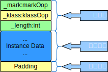

# Java 对象实例化

## 创建对象的方式

> new
> > 1. 最常见的 new
> > 2. 单例模式构造器访问权限被设置为私有，通过调用静态方法创建对象
> > 3. XxxBuilder/XxxFactory 工厂模式的静态方法创建对象
> 
> newInstance()
> > Class的newInstance()\
> > jdk9被标记为过时，反射方式，比较苛刻，只能调用空参构造器，且构造器访问权限必须设置为public
> 
> newInstance(args)
> > Constructor的newInstance(args)\
> > 替代Class的newInstance()，反射方式，可以调用无参、有参构造器，且对构造器访问权限没有要求
> 
> clone()
> > 不调用构造器，当前类需要实现Cloneable接口，实现clone()
> 
> 反序列化
> > 从文件或网络中获取一个对象的二进制流，将二进制流转换为对象
> 
> 第三方库 Objenesis

## 创建对象的步骤

> 1. 判断对象对应的类是否Loader加载、Linking链接、Initialization初始化
> > JVM遇到一条new指令，首先去检查这个指令的参数能否在Metaspace的常量池中定位到一个类的符号引用，\
> > 检查这个符号引用代表的类的元信息是否存在即该类是否已经加载、解析、初始化
> > > 如果不存在，在双亲委派模式下，使用当前类加载器以ClassLoader+包名+类名为Key进行查找对应的.class文件。
> > > > 如果没有找到文件，则抛出ClassNotFoundException \
> > > > 如果找到文件，则进行类加载，并生成对应的Class类对象
> > > 
> > > 如果存在，则继续后续步骤
>
> 2. 为对象分配内存
> > 如果内存规整
> > > 指针碰撞
> >
> > 如果内存不规整
> > > 虚拟机需要维护一个列表\
> > > 空闲列表分配
> >
> > 说明[TODO]
> 
> 3. 处理并发安全问题
> > 采用CAScompare and swap配上失败重试保证更新的原子性atomic\
> > 每个线程预先分配一块**线程私有的分配缓冲区**TLAB.Thread Local Allocation Buffer
> 
> 4. 初始化分配到的空间
> > 所有属性设置默认值，保证对象实例字段在不赋值时可以直接使用
> 
> 5. 设置对象的对象头
> 6. 执行<init>方法进行初始化

## 计算实体对象占用内存

> 实例对象内存计算
> > 
> 
> 数组对象内存计算
> > 
>
> Head对象头
> > _mark: MarkWord存储对象自身运行时数据
> > > 32位系统 占用4byte\
> > > 64位系统 占用8byte
> >
> > _klass: klass指针，指向该类元数据的指针，jvm通过这个指针确定这个对象是哪个类的实例
> > > 32位系统 占用4byte\
> > > 64位系统
> > > > 不开启指针压缩 占用8byte \
> > > > 开启指针压缩 占用4byte
> >
> > _length: 数组对象才有，用来记录数组长度。
> > > 占用4byte
> 
> Instance Data实例数据
> > 对象真正存储的有效信息，各类型字段内容，父类继承和自己定义的 \
> > 继承关系
> > > 先存放父类中的成员，接着才是子类中的成员，父类要按照8byte规定对齐\
> > > 例如枚举（相当于继承） 有一个String，具体枚举大小=8+4+（4+4）+4=24\
> > > markWord=8，klass=4，父类有一个String=4，父类对齐+4=（4+4）=8，此时大小为20，对齐+4=24
> 
> Padding对齐填充
> > HotSpot VM的自动内存管理系统要求对象起始地址必须是8字节的整数倍，最终字节大小要能被8整除。
> > > 不能被整除时使用padding补位到能被8整除的长度
> >
> > 访问未对齐的内存，处理器需要作两次内存访问\
> > 访问已对齐的内存，处理器仅需要一次内存访问

## 附录 

|    类型     | 字节数(Byte) | 位数(bit) |                               取值范围                                |
|:---------:|:---------:|:-------:|:-----------------------------------------------------------------:|
|   byte    |     1     |    8    |                           -2^7 ~ 2^7-1                            |
|   short   |     2     |   16    |                          -2^15 ~ 2^15-1                           |
|    int    |     4     |   32    |                          -2^31 ~ 2^31-1                           |
|   long    |     8     |   64    |                          -2^63 ~ 2^63-1                           |
|  boolean  |     1     |    8    |                            true和false                             |
|   char    |     2     |   16    |           unicode编码，前128字节与ASCII兼容字符存储范围在 \u0000~\uFFFF           |
|   float   |     4     |   32    | 3.402823e+38 ~ 1.401298e-45（e+38表示是乘以10的38次方，同样，e-45表示乘以10的负45次方） |
|  double   |     8     |   64    |                   1.797693e+308~ 4.9000000e-324                   |
| reference |    4/8    |  32/64  |         引用型数据，32位系统或开启指针压缩的64位系统占用4byte，64位系统不开指针压缩占8byte         |

| 对象头           | _mark                | _klass                            | _length         |
|:--------------|:---------------------|:----------------------------------|:----------------|
| 描述            | MarkWord 存储对象自身运行时数据 | 指向该类元数据的指针，jvm通过这个指针确定这个对象是哪个类的实例 | 数组对象才有，用来记录数组长度 |
| 32位系统         | 4byte                | 4byte                             | 4byte           |
| 64位系统 开启指针压缩  | 8byte                | 4byte                             | 4byte           |
| 64位系统 不开启指针压缩 | 8byte                | 8byte                             | 4byte           |

[home](../index.md#jvm)